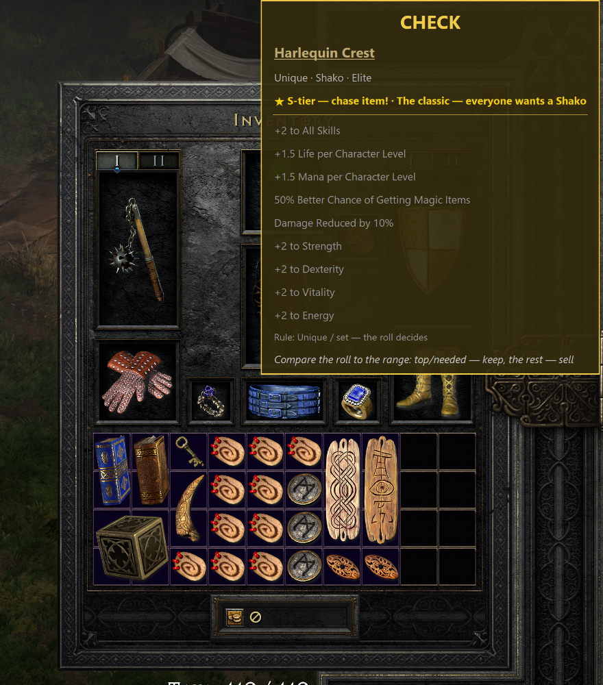
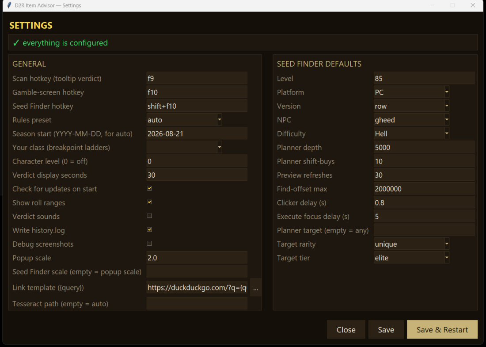
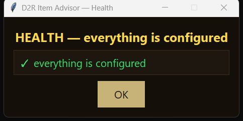
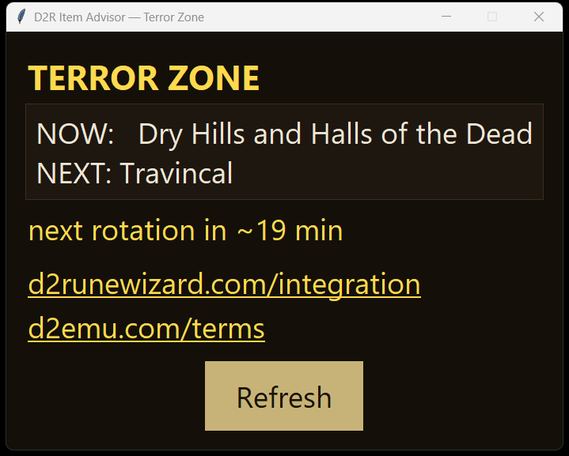
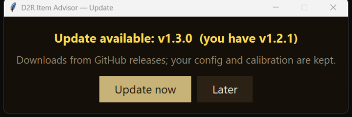
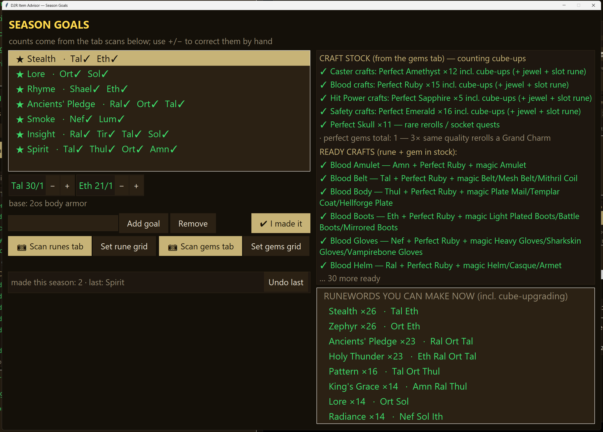
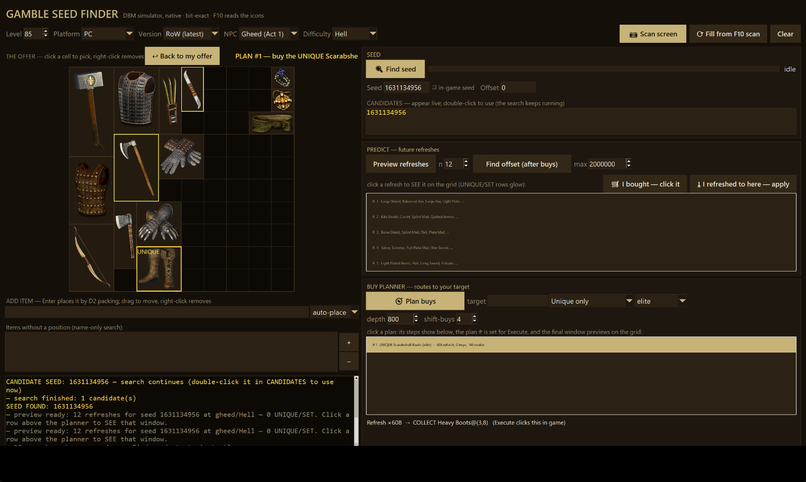
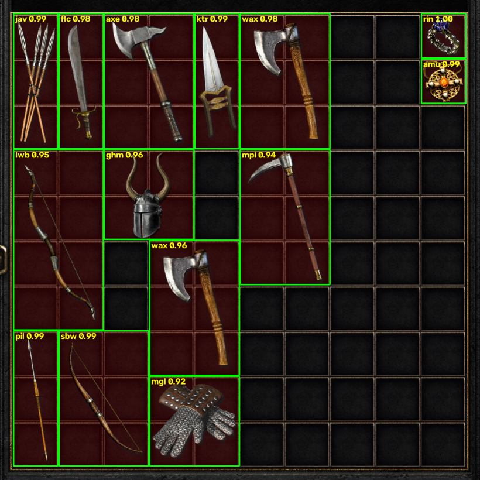

# D2R Item Advisor

Hover an item in Diablo II: Resurrected, press **F9** — a verdict pops up
next to the cursor: **KEEP / CHECK / TRASH** (plus the recognized item and
the rule that fired).

For uniques and sets the verdict shows the **full stat list with roll
ranges**: variable stats are highlighted and the recognized roll is
compared against its range (★ MAX = perfect roll). Item quality is pinned
by the **color of the name line** in the tooltip (green = set, gold =
unique/runeword, yellow = rare, blue = magic), so even an item missing
from the name database is never mistaken for a plain gray base.

Everything works from screenshots and OCR only — **no game memory is
read, nothing is injected into the process** (the safest class of tools;
still, any third-party program is formally a gray area under Blizzard's
ToS — use at your own risk).

> **Scope note.** The item advisor (verdicts, roll ranges, runeword /
> craft / gamble advice) reads your screen and works **anywhere —
> online and offline alike**. Only the **gambling seed features**
> (Seed Finder, refresh forecasts, buy planner, auto-clicker) are
> **single player / offline only**: the seed mechanics exist only where
> the RNG runs locally — online/ladder RNG is server-side and cannot be
> predicted or influenced by this tool (or any tool); that part is
> provided for offline play and educational interest in the game's RNG
> internals.

  

*A real F9 scan: the popup pins the quality by the tooltip name color,
matches the unique, shows the S-tier value verdict and every stat with
its roll range — clickable name opens the item's page.*

## Requirements

- Windows 10/11
- **English game client** (the OCR model is trained on the English D2R font)
- In game settings: **Options → Interface → Large Font Mode = ON**
  (large tooltip font — greatly improves recognition accuracy)
- **Tesseract OCR** — needed only for the tooltip verdicts (F9), every
  other feature works without it:
  `winget install UB-Mannheim.TesseractOCR` (or the installer from
  https://github.com/UB-Mannheim/tesseract/wiki)
- Optional: **Node.js** (https://nodejs.org) — turns the seed search from
  minutes into seconds

## Installation — standalone exe (recommended)

1. Download **d2r-advisor-…-windows-x64.zip** from
   [Releases](https://github.com/psolvy/d2r_advisor/releases), unpack
   anywhere, run `d2r-advisor.exe`.
2. The app lives in the **system tray** (check the `^` overflow area).
   Double-click the icon → **Settings**, with a health panel that says if
   anything is missing (e.g. Tesseract) and what that disables.
3. On first run it downloads the gamble icons and fast-search workers
   automatically and adds itself to the **Start Menu**.

## Installation — from source (only if you prefer to)

1. Install Python 3.9+ — https://www.python.org/downloads/ (check
   **Add python.exe to PATH** in the installer).
2. Double-click `install.bat` — installs Tesseract (via winget), the
   Python dependencies, and the assets that are not part of the
   repository (see
   [Licensing](#licensing-and-third-party-content)).
3. Start with `run.bat` (a console window appears — the exe build uses
   `advisor.log` instead).

Either way, run the game in **Windowed** or **Windowed Fullscreen**
mode — in exclusive fullscreen the overlay may not show above the game.

## Usage

1. Start the app (`d2r-advisor.exe` or `run.bat`).
2. In game, open the inventory and hover an item so its tooltip shows.
3. Press **F9** (keep the mouse on the item). The verdict appears in
   ~1-2 seconds.
4. Click the verdict popup to dismiss it.

## Customization

The app lives in the **system tray**: double-click the icon for
**Settings** — every config value is editable there (hotkeys, rules
preset, scales, Seed Finder defaults, tesseract path…), with a health
panel on top that says what is not configured yet (e.g. Tesseract
missing) and what that disables. "Save & Restart" applies everything.
The standalone exe also hides its console into the tray and adds itself
to the Start Menu on first run.

  

**Health check** in the tray opens the same what-is-missing report as a
standalone window:

  

The tray also has **Check for updates** (plus an automatic check on
start, `auto_update` in the config): when a new GitHub release exists,
one click downloads it and swaps the build in place — your config,
calibration and downloaded assets survive.

**Terror Zone** in the tray shows the current and next zone with a
countdown to the hourly rotation (auto-refreshes right after the flip).
Works out of the box (d2runewizard.com — no token needed for now,
confirmed by its maintainer; a token is still sent when set in
Settings). d2emu.com is supported too and needs a token + your account
name (`tz_api_user`).

  

  

Everything the UI edits is plain `config.yaml`, editable by hand too:

- `config.yaml` — hotkeys, **rules preset**, display time, roll ranges
  on/off, tesseract path, debug.
- Rule presets (`preset:` in config.yaml):
  - `leveling` — ladder start / leveling: all runes and gems, skillers,
    charms with low thresholds, bases for Insight/Spirit;
  - `midgame` — 75+: runes from Shael up, flawless/perfect gems, higher
    thresholds, bases for CoH/Exile;
  - `lategame` — endgame: only Pul+, perfects, top charms; uniques/sets
    are "check" (the roll decides, ranges shown in the popup);
  - `custom` — your own `rules.yaml` in the project root (a copy of
    leveling by default).
  The rule format is documented at the top of every preset
  (`presets/*.yaml`); long shared affix lists (skiller trees, +2 class
  skills) live once in `presets/_common.yaml` and rules reference them
  with `affix_any_ref: {list: skill_trees, min: 1}`. A stat that OCR
  read as `0` never satisfies a min/max rule — the rule is skipped and
  the item escalates to CHECK with a "value read as 0" note instead of
  being trashed.

  The engine also understands:
  - `affix_n_of: {min: 2, any: [...]}` — "at least N of these mods";
    this is how **rare rings/amulets are actually evaluated** now (2+
    good mods = keep, 1 = check; lategame wants 3+);
  - `affix_sum: {affixes: [...], min: 40}` — summed values, e.g. total
    resistances across the four single-res affixes;
  - **score rules** — `score: N` instead of a verdict accumulates
    points, a top-level `scoring: {keep: X, check: Y}` block converts
    the total, and a better score verdict cannot be shadowed by an
    earlier broad rule;
  - **class-aware lists** — set `my_class` in Settings and
    `{list: skill_trees, class: mine}` / `class: other` split skillers
    into "yours = keep, other classes = check/trade".

Exact affix templates for rules live in
`d2rlootreader/repository/affixes.json` (numbers are replaced with `#`,
e.g. `"+#% Faster Cast Rate"`).

**Playing a mod?** Drop JSON files into
`d2rlootreader/repository/overlay/` (same names as the vanilla tables:
`uniques.json`, `set.json`, `bases.json`…) — they merge over the
shipped data and survive updates. Unrecognized gold/green items say
"name not in the database (mod item?)" in the popup instead of silently
fuzzy-matching a look-alike vanilla item.

Every verdict popup carries a small "**⚑ verdict wrong?**" link — one
click appends the OCR lines, the verdict and the fired rule to
`tuning.jsonl`, the raw material for tuning your rules (or filing a
good bug report).

On a fresh install a **30-second welcome wizard** opens once: popup
scale suggested from your monitor, hotkeys with a duplicate check, and
one-click Tesseract install.

For white bases the verdict lists **runewords that fit the base and its
socket count** (respecting the base's maximum sockets); for unsocketed
bases — the cube/Larzuk recipes to punch sockets.

Additionally:
- **runes**: cube upgrade recipe + runewords using the rune;
- **gems**: upgrade path and uses (GC rerolls, crafts);
- **uniques/sets**: S/A/B/C value tier from the curated database
  (`repository/value_tiers.json` — edit to match the current market);
- **verdict sound** (high = keep, mid = check, low = trash) — `sounds`
  in the config;
- **scan journal** `history.log` (JSON lines) — `history` in the config.

**Underlined lines in the popup are clickable** — a click opens the
browser with details (runeword, craft recipe, unique page). Configure the
destination via `link_template` in config.yaml (web search by default;
diablo2.io etc. work too). Clicking a link keeps the popup open; clicking
anywhere else closes it. **Right-click copies** a trade-chat-ready
line ("Harlequin Crest (Unique Shako) | +2 To All Skills; …").

## Gear compare (Shift+F9)

Hover an item and **hold Shift** — the game shows the equipped piece
next to it. Press **Shift+F9** (configurable) and the popup lists what
the hovered item **gains and loses** vs what you wear: green `+` lines,
red `−` lines, `▲/▼` for changed values — including **Defense and
requirement** changes pulled straight from the tooltip. With two
equipped rings the popup shows both diffs, labeled "vs equipped #1/#2".
Pure screen reading — works online while leveling, exactly when "is
this better?" matters most.

Tradeable finds (unique/set/runeword/rare/craft — **runes and gems**
too) get a clickable **💰 Price check** line — the destination is `price_link_template` in
the config (Traderie search by default).

## Season goals (runeword tracker)

  

Tray → **Season goals**: pick the runewords you are building this ladder
(Stealth, Lore, Insight, Spirit… seeded by default). Fill the rune
counters either with the **📷 Scan runes tab** button — open the stash
RUNES tab in game, and one screenshot sets every counter (a one-time
4-point grid calibration: first cell, end of the top row, the cell
below the first, and the last cell; the exact pitch is then measured
from the image itself) — or by hand with the +/− chips. Before
replacing a non-empty pool the scan shows a **diff preview**
("Tal 21→30 … apply?"). The **gems tab scans the same way** (its own
4-point grid) and feeds the **Craft stock** panel.

The window also shows:
- **STILL MISSING** — the farming shopping list aggregated across every
  tracked goal, most-blocking rune first;
- the selected goal's **base requirement** ("4os sword/shield") and an
  **executable cube chain** for the gaps ("3× Amn + chipped amethyst →
  Sol");
- **READY CRAFTS** — the real cube.json recipes whose rune *and*
  perfect gem are both in stock ("Blood Gloves — Nef + P.Ruby + magic
  Heavy Gloves…"), next to the per-family perfect-gem stock;
- the **made log** with an **Undo last** button ("I made it" refuses an
  incomplete goal and records the spent runes so undo can restore
  them).

The verdict popup on a scanned rune shows live progress — "goal
Stealth: missing Eth", or "🏁 ALL RUNES READY — make it!" when the last
one is in place. State lives in `season_goals.json` (local, never
committed).

Cube and crafts:
- **magic item on a craftable base** → craft recipes (Blood / Caster /
  Hit Power / Safety) with the required rune and gem;
- **unique/rare on a non-elite base** → tier upgrade recipe
  (runes + gem → new base);
- **set item** → the other set pieces and the green set bonuses with
  piece thresholds;
- **vendor/gamble tooltip** (a Cost/Buy line) → advice whether the base
  is worth gambling.

## Gambling: F10 and the Seed Finder (Shift+F10)

*(offline characters only — online gambling is rolled on Blizzard's
servers and no simulator can predict it)*

  

*A live session: the offer is on the grid (the 🎲 button rolls a random
seed to explore without scanning anything), the forecast lists upcoming
refreshes, and the planner routed to UNIQUEs — each plan names the exact
item it produces ("= Sandstorm Trek", or "1 of N" for jewelry where the
game rolls among candidates); the glowing slot is where it will sit when
you buy it.*

- **F10** on the gamble screen: reads the whole offer and copies the list
  to the clipboard. In **resurrected graphics** the gamble window shows
  icons without text, so reading is **icon-based** (template matching,
  icons in `repository/gamble_icons/`). The grid is located
  **automatically** (via the Ring+Amulet pair in the top-right corner) —
  no calibration needed; grid **positions** are recognized too, so the
  auto-clicker only needs the Refresh button set ("Set Refresh button").
  In **legacy graphics** (text list) OCR works as before.

  

    
  

  *What the recognizer sees: every item boxed on the auto-located grid
  with its template-match confidence (this debug view is saved to
  `debug/` on every F10 scan).*
- The Seed Finder window is a modern dark UI with the **site-style visual
  10×10 grid**: the offer is shown as icons; click a cell to pick an item
  (searchable dropdown with icons), right-click removes. The window is
  freely resizable; scale via `seedfinder_scale` in config.yaml.
- **Shift+F10** — the **Gamble Seed Finder**: a full local port of the
  [gambling.diablo.deadlybossmods.com](https://gambling.diablo.deadlybossmods.com/)
  simulator (engine, buy planner and vendor fill validated **bit-exact**
  against the site's workers). Everything the site does, plus:
  - the offer is **pre-filled automatically** from the last F10 scan — no
    manual entry, just correct OCR mistakes if any;
  - **grid positions are optional**: a full 14-item list is enough
    (the site always requires positions);
  - "Find seed" brute-forces all 2^32 seeds on all cores (seconds via the
    site's own kernel in Node, minutes on the built-in engine), fills the
    Seed field and immediately prints upcoming refreshes;
  - the forecast shows **purchase quality**: which slot of which refresh
    becomes **UNIQUE / SET / rare** (the whole point of the simulator);
  - "Plan buys" — the **buy planner** (a port of the site's
    search.worker): finds the shortest route of refreshes and
    pool-shifting buys to a target item (any unique/set/rare, or a
    specific base + quality + tier);
  - "Execute plan" — the **auto-clicker**: clicks the chosen plan through
    in game (refresh = button click, buy = right-click on the cell) with
    a focus countdown and live progress. Grid cells calibrate
    **automatically on the F10 scan**; you only set the Refresh button
    ("Set Refresh button") and the "**Set sell zone**" — the empty
    inventory area where purchases land: filler buys are **auto-sold
    back** (Ctrl+click, consumes no RNG). **Keep that zone empty** —
    the sweep sells whatever sits in it. Every click checks that
    Diablo II is still the foreground window (alt-tab aborts the run),
    and ESC is the emergency stop at any point, including mid-sweep.
    After a run (or a stop) the RNG state is **applied automatically** —
    the grid, forecasts and planner continue from the current moment;
  - "Find offset (after buys)" — manual purchases shift the RNG stream;
    enter the current offer and the offset resyncs;
  - selectors: platform (PC=msvc/consoles), version (D2R/classic/RoW),
    NPC and difficulty (they drive the "vendor fill" — the vendor
    inventory top-up on window open that shifts all later refreshes),
    an "in-game seed" checkbox for seeds taken from the game.

Offline tests (no game, no Tesseract): `py -3 tests\test_regression.py`.

After a game patch, refresh the knowledge bases:
`python tools/update_repository.py`, then `python tools/gen_ranges.py`,
`python tools/gen_runewords.py` and `python tools/gen_cube.py`
(data comes from [blizzhackers/d2data](https://github.com/blizzhackers/d2data)).

## If recognition is poor

1. Enable Large Font Mode (mandatory).
2. Set `debug: true` in `config.yaml` (for the standalone exe all
   mutable files — `config.yaml`, `rules.yaml`, calibration, season
   goals, `history.log`, `advisor.log` and `debug/` — live in
   `%LOCALAPPDATA%\d2r-advisor`), press F9 on the problematic item —
   `debug/` gets `*_full.png` and `*_crop.png`. Failed scans dump a raw
   frame there automatically even with debug off (60 newest files are
   kept). If `_crop.png` is not the tooltip, the detector missed — share
   the images so it can be tuned.
3. Tooltips over dark textures (equipped gear on the left) read worse —
   keep the item in the right-side inventory bag.

## How it works

`F9` → full-screen screenshot (mss) → dark tooltip rectangle search near
the cursor (OpenCV) → D2R font OCR (Tesseract + the trained
`d2r.traineddata` model) → stat parsing into JSON (fuzzy matching against
the unique/set/affix database from
[d2r-loot-reader](https://github.com/lucekdudek/d2r-loot-reader)) → your
rules from `rules.yaml` → verdict popup (tkinter).

## Licensing and third-party content

The tool is distributed under **GPL-3.0-or-later** (see LICENSE): it
contains code and data from
[d2r-loot-reader](https://github.com/lucekdudek/d2r-loot-reader)
(GPL-3.0-or-later) and the D2R font OCR model from the horadricapp
project (MIT). Item tables are generated from
[blizzhackers/d2data](https://github.com/blizzhackers/d2data) dumps.

**What is NOT in the repository** (and why): content we do not own is
not redistributed — `install.bat` (step 4) or
`python tools/setup_assets.py` downloads it to your machine at install
time, exactly the way a browser does when you open the corresponding
sites (the standalone exe does the same on first run):

- `d2rlootreader/repository/gamble_icons/` — item icons (Blizzard art,
  served by the DBM site) — needed for icon-based F10 recognition;
  without them the OCR fallback still works;
- `tools/dbm_validation/*.worker.js` — the workers of the
  [gambling.diablo.deadlybossmods.com](https://gambling.diablo.deadlybossmods.com/)
  simulator — give "website speed" in Find seed; without them the search
  runs on the built-in numpy engine (slower);
- `tools/_cache/` — d2data JSON dumps, fetched by the generators
  automatically.

Blizzard Entertainment is not affiliated with this project. Diablo® II
is a trademark of Blizzard Entertainment. Using third-party programs is
formally a gray area under the game's ToS — use at your own risk.

## CI / CD

- **CI** (`.github/workflows/ci.yml`): every PR and every push to `main`
  — compile all modules + 80 offline engine/parser/planner/goals/
  settings tests (Windows, Python 3.12 and 3.13, plus a 3.9 syntax-floor
  compile job). The release build also **smoke-tests the packaged exe**
  before publishing. Icon tests skip automatically when
  the icons are not downloaded (they never are in CI — see above).
- **CD** (`.github/workflows/release.yml`), two paths:
  - a merge to `main` triggers CI, and a **green CI** then triggers the
    release build automatically (CI → CD), refreshing the rolling
    **`latest` pre-release** with a standalone **PyInstaller exe**
    bundle (sources come from GitHub's own "Source code" archive);
  - a `v*` tag cuts a **versioned release** with the same artifact
    and auto-generated notes: `git tag v1.0.1 && git push origin v1.0.1`.

Contributions welcome — see [CONTRIBUTING.md](CONTRIBUTING.md); bugs and
feature requests go through the
[issue templates](../../issues/new/choose).
